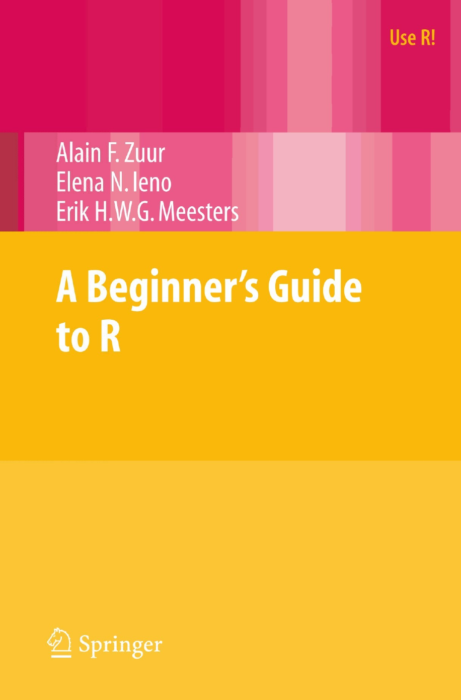

# A Beginner's Guide to R

Exercicies from the book "A Beginner's Guide to R" of Zuur et al. 2009



Zuur, A. F., Ieno, E. N., & Meesters, E. H. (2009). **A Beginner's Guide to R** (p. 150). New York: Springer.

```
@book{zuur2009beginner,
  title={A Beginner's Guide to R},
  author={Zuur, Alain F and Ieno, Elena N and Meesters, Erik HWG and others},
  year={2009},
  publisher={Springer}
}

```